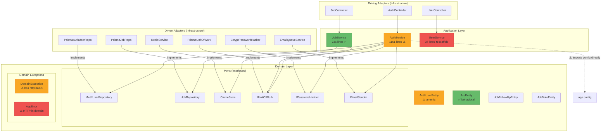

# Senior Staff Engineer — Hexagonal Architecture Critique

## Executive Summary

This codebase attempts hexagonal architecture (ports & adapters) on top of NestJS + Prisma + MongoDB. **The `job` module is a genuinely well-executed hexagon** — clean domain entities, proper port/adapter separation, and the service knows nothing about Prisma. The `auth` module is _partially_ migrated and carries significant tech debt. The `user` module is a scaffold with zero actual implementation. Cross-cutting concerns (logging, error handling, caching) are solid. However, there are **several structural violations** of the hexagonal architecture, **dead code**, **security risks in the controller layer**, and a **complete absence of tests for the module that's actually well-architected**.

**Verdict: 6.5/10** — Promising foundation with genuine architectural understanding, undermined by inconsistent application across modules and several production-readiness gaps.

---

## 1. Architecture — What's Actually Good

Before the criticism, credit where it's due:

### ✅ Job Module — Textbook Hexagonal

```
job/
  domain/           ← Pure entities, repo interfaces (PORTS)
    entities/       ← JobEntity, JobFollowUpEntity, etc.
    repositories/   ← IJobRepository, IJobNoteRepository, etc.
  application/      ← Service orchestration (APPLICATION LAYER)
    services/       ← JobService — injects PORTS only
  infrastructure/   ← Adapters — Prisma implementations
    controllers/    ← HTTP adapter (DRIVING PORT)
    persistence/    ← Prisma repos (DRIVEN PORT adapters)
  dto/              ← Input/output contracts
```

- `JobService` injects **only interfaces** via tokens — zero Prisma imports
- Domain entities have genuine business methods (`changeStatus`, `toggleArchive`, `recordFollowUpCompleted`)
- Status-to-timeline mapping is domain logic, correctly placed in the entity
- Unit of Work properly abstracts transactions
- `PrismaErrorMapper` cleanly translates infrastructure errors to domain exceptions

### ✅ Common Domain Layer

- `IUnitOfWork` + `ITransactionContext` — well-documented, properly branded opaque type
- `ICacheStore`, `IPasswordHasher`, `IEmailSender` — clean secondary port abstractions
- `DomainException` hierarchy — framework-agnostic exception system
- `AllExceptionsFilter` correctly maps `DomainException` → HTTP without leaking infrastructure

---

## 2. Architectural Violations — The Dependency Rule

> [!CAUTION]
> The Dependency Rule states: **source code dependencies must point inward** — domain never imports from infrastructure.

### 2.1 `DomainException` Contains HTTP Status Codes

```typescript
// common/domain/exceptions/domain.exception.ts
export class DomainException extends Error {
  public readonly httpStatus: number;  // ← HTTP IS INFRASTRUCTURE
  constructor(message: string, httpStatus: number = 500, code: string = 'DOMAIN_ERROR') {
```

**Problem:** The domain layer is embedding HTTP semantics. `httpStatus: 404` means nothing in a CLI, gRPC, or WebSocket context. This is the single most fundamental hexagonal violation in the codebase.

**Should be:**
```typescript
export class DomainException extends Error {
  public readonly severity: 'NOT_FOUND' | 'CONFLICT' | 'VALIDATION' | 'AUTHORIZATION' | 'INTERNAL';
}
// The exception filter maps severity → HTTP status
```

### 2.2 `AppError` Is a Domain Exception That Speaks HTTP

```typescript
// common/errors/app.error.ts
class AppError extends DomainException {
  static badRequest(message: string): AppError { return new AppError(400, message); }
  static unauthorized(message: string): AppError { return new AppError(401, message); }
```

`AppError` is used **directly inside `AuthService`** (a domain/application service). The service is literally constructing HTTP 429, 401, 403 status codes. This means your auth business logic is coupled to HTTP.

### 2.3 `AuthService` Has Dead Infrastructure Methods

```typescript
// auth.service.ts:1031-1047
private async handleMissingLoginUserFailure(...) { ... }
// auth.service.ts:1049-1051
private throwOAuthLoginRequired(provider: string): never { ... }
// auth.service.ts:1053-1072
private handleBlockedLoginFailure(...) { ... }
// auth.service.ts:1074-1079
private async handleInactiveLoginFailure(...) { ... }
```

**None of these methods are called anywhere.** They're dead code — likely leftovers from a refactor. The `login()` method duplicates this logic inline (e.g., lines 462-476 do the same thing as `handleMissingLoginUserFailure`).

---

## 3. Inconsistent Architecture Across Modules

> [!WARNING]
> The three modules (`auth`, `job`, `user`) follow three completely different architectural patterns. This is the biggest structural problem in the codebase.

| Aspect | `job` Module | `auth` Module | `user` Module |
|---|---|---|---|
| **Architecture** | Full hexagonal | Partial hexagonal | NestJS scaffold (no arch) |
| **Domain entities** | ✅ Rich, behavioral | ✅ Present but anemic | ❌ None — uses plain class |
| **Repository ports** | ✅ Clean interfaces | ✅ Interfaces exist | ❌ None |
| **Service layer** | ✅ Uses ports only | ⚠️ Hybrid (ports + `config` import) | ❌ Returns string literals |
| **Controller placement** | `infrastructure/controllers/` | Top-level `auth.controller.ts` | Top-level `user.controller.ts` |
| **Tests** | ❌ Zero tests | ✅ Tests exist (but stale) | ✅ Tests exist (scaffold) |
| **Business logic** | ✅ In entities | ⚠️ Split between service & entity | ❌ None |

### 3.1 The `user` Module Is a Placeholder Shipped as Production Code

```typescript
// user.service.ts
create(createUserDto: CreateUserDto) {
  void createUserDto;
  return 'This action adds a new user';
}
```

This is a raw NestJS CLI scaffold. It has:
- No database interaction
- No hexagonal structure
- No domain entity (the "entity" is a Swagger DTO)
- No repository
- Returns string literals

**Yet it has `@ApiResponseDecorator` annotations** and is exported in the module as if it's production-ready. This is misleading. It should either be removed or flagged as `// TODO: implement`.

### 3.2 Auth Controller Lives Outside Infrastructure

In the `job` module, the controller correctly lives at `infrastructure/controllers/job.controller.ts`. In the `auth` module, `auth.controller.ts` sits at the module root — the same level as the domain. This breaks the layering convention.

---

## 4. Security Issues

> [!CAUTION]
> These are production security risks that should be addressed before deployment.

### 4.1 Unauthenticated Logout and Logout-All Endpoints

```typescript
// auth.controller.ts:343-376
@Post('logout')
async logout(
  @Body('refreshToken') refreshToken: string,
  @Body('userId') userId: string,
) { ... }

@Post('logout-all')
async logoutAll(@Body('userId') userId: string) { ... }
```

**Both endpoints accept `userId` from the request body with no `AuthGuard`.** Any client can:
1. Send `POST /auth/logout-all` with any userId → revokes all sessions for that user
2. This is a **denial-of-service vulnerability** — an attacker can force-logout any user

**Fix:** These endpoints MUST require authentication, and `userId` should come from the JWT payload, not the request body.

### 4.2 Google OAuth Callback Leaks Tokens in URL

```typescript
// auth.controller.ts:197-206
if (result.redirectUrl) {
  const redirectUrl = new URL(result.redirectUrl);
  redirectUrl.searchParams.set('access_token', result.accessToken);
  redirectUrl.searchParams.set('refresh_token', result.refreshToken);
  return res.redirect(redirectUrl.toString());
}
```

Access and refresh tokens are appended as **query parameters**. These will be:
- Logged in browser history
- Logged in server access logs
- Visible in the Referer header of any subsequent request
- Cached by intermediary proxies

**Industry standard:** Use a short-lived authorization code, or pass tokens as a URL fragment (`#access_token=...`) which is never sent to the server.

### 4.3 Timing-Attack Fake Hash Is Invalid

```typescript
// auth.service.ts:459-460
const fakePasswordHash = '$2a$12$LQv3c1yqBWVHxkd0LHAkCOYz6TtxMQJqhN8/X4.G4.4.G4.G4.G4.G';
```

The intent is good (constant-time response), but this hash string is not a valid bcrypt hash. bcrypt will reject it immediately without doing the full computation, defeating the timing protection. You should pre-compute a real hash at startup:

```typescript
private readonly fakeHash = bcrypt.hashSync('dummy-password', 12);
```

---

## 5. Domain Entity Design Issues

### 5.1 God-Constructor Anti-Pattern

`JobEntity` has a **47-parameter constructor**:

```typescript
export class JobEntity {
  constructor(
    public readonly id: string | null,
    public readonly authId: string,
    public company: string,
    public companyUrl: string | null,
    // ... 43 more parameters
  ) {}
```

This is unmaintainable. Adding a single field requires updating:
1. The entity constructor
2. The mapper
3. The DTO
4. The service (the 47-line `new JobEntity(...)` call)
5. The update method (the 40-line if-chain)

**Better approach:** Use a builder pattern or a props interface:
```typescript
interface JobProps { company: string; role: string; /* ... */ }
class JobEntity {
  constructor(public readonly id: string | null, private props: JobProps) {}
  static create(authId: string, props: CreateJobProps): JobEntity { ... }
}
```

### 5.2 `AuthUserEntity` Claims "Contains Business Logic" But Is Anemic

```typescript
// auth-user.entity.ts docstring: "Contains business logic for user account management."
// Actual methods:
get isActive(): boolean { return this.status === 'ACTIVE'; }
get isBlocked(): boolean { return this.status === 'BLOCKED' || this.status === 'SUSPENDED'; }
verifyEmail(): void { this.verified = true; }
incrementTokenVersion(): void { this.tokenVersion += 1; }
```

These are getter wrappers and trivial setters. There's no real domain invariant enforcement. Meanwhile, the actual business logic (password validation, rate limiting, token rotation, account lockout) lives entirely in `AuthService`. The entity's `verifyEmail()` and `incrementTokenVersion()` methods are **never called** — the service calls `authUserRepo.updateVerified()` directly.

### 5.3 Mutable `readonly` Contradiction

```typescript
// job.entity.ts docstring: "Properties are readonly. State changes go through explicit methods"
// Actual code:
public company: string;         // ← NOT readonly
public companyUrl: string | null; // ← NOT readonly
```

Only `id`, `authId`, `createdAt`, and `updatedAt` are readonly. Everything else is `public` and directly mutated in the service (the 40-line if-chain in `updateJob`).

---

## 6. Testing Critique

### 6.1 Tests Are Stale and Partially Broken

The auth service spec (603 lines) still references:
- `PrismaService` directly in mocks — but the service now uses repository ports
- `EmailQueueService` — but the service now uses `IEmailSender` port
- `RedisService` — but the service now uses `ICacheStore` port
- `mockTransaction` that mimics Prisma's `$transaction` — but the service now uses `IUnitOfWork`

The tests mock both the old Prisma interface AND the new port tokens simultaneously, creating a confusing dual-mock setup where some assertions verify the Prisma mock while the actual code goes through the repository mock.

### 6.2 Zero Tests for the Best Module

The `job` module — the one that's actually well-architected with clean port/adapter separation — **has zero test files**. No unit tests for `JobService`, no unit tests for `JobEntity` domain logic, no controller tests.

### 6.3 No Integration or E2E Tests

The e2e test file is the default NestJS scaffold:
```typescript
it('/ (GET)', () => {
  return request(app.getHttpServer()).get('/').expect(200);
});
```

---

## 7. Code Duplication & DRY Violations

### 7.1 Meta Extraction Is Copy-Pasted 8 Times

```typescript
// This exact block appears in EVERY controller method:
const meta = {
  ip: req.ip || 'unknown',
  userAgent: req.headers['user-agent'] || 'unknown',
  device:
    (Array.isArray(req.headers['x-device'])
      ? req.headers['x-device'][0]
      : req.headers['x-device']) ||
    (Array.isArray(req.headers['x-device-id'])
      ? req.headers['x-device-id'][0]
      : req.headers['x-device-id']) ||
    (Array.isArray(req.headers['sec-ch-ua-platform'])
      ? req.headers['sec-ch-ua-platform'][0]
      : req.headers['sec-ch-ua-platform']),
};
```

**This appears 8 times** across `auth.controller.ts`. Extract to a decorator or interceptor:
```typescript
@ExtractMeta() meta: RequestMetadata
```

### 7.2 `PrismaService` and `RedisService` Registered in Multiple Modules

Both `PrismaService` and `RedisService` are directly provided in `AuthModule` AND `JobModule`. Since `RedisModule` is already global, the local `RedisService` providers create duplicate instances. `PrismaService` should be in a global `PrismaModule`.

### 7.3 `UNIT_OF_WORK_TOKEN` Bound Twice

`PrismaUnitOfWork` is provided in both `AuthModule` and `JobModule`. This means two separate instances of the unit of work, which is fine for now but will break if you ever need cross-module transactions.

---

## 8. Naming & Convention Issues

| Issue | Location | Problem |
|---|---|---|
| Prisma model naming | `loginHistory`, `emailHistory`, `userProfile` | camelCase models, but `ActivityLogEvent` is PascalCase. Pick one. |
| Enum naming | `userRole`, `email_type`, `JobStatus` | Three different conventions: camelCase, snake_case, PascalCase |
| Token naming | `'IAuthUserRepository'` | String tokens should use Symbol() for collision safety |
| `config` import | `import config from '../../common/config/app.config'` | Domain services import config directly — this is an infrastructure concern |
| Default export | `export default AppError` | Only file using default export. Rest use named exports |
| `IEmailSender` vs `EmailService` | `email-sender.interface.ts` vs `email.service.ts` | Interface says "sender", but `EmailService` doesn't implement `IEmailSender`. The `EmailQueueService` does. Confusing naming. |

---

## 9. Missing Capabilities

| Capability | Status | Impact |
|---|---|---|
| **CORS configuration** | ❌ Missing entirely | Frontend won't work |
| **API versioning** | ❌ Missing | Breaking changes will break clients |
| **Request ID tracing** | ❌ Missing | Cannot correlate logs across services |
| **Health check endpoint** | ❌ Missing | Load balancers/k8s have nothing to probe |
| **Graceful shutdown** | ❌ Missing | In-flight requests will drop on deploy |
| **Input sanitization** | ⚠️ Partial (`whitelist: true` in ValidationPipe) | XSS possible in string fields |
| **Pagination on auth endpoints** | ❌ Missing | Login history, email history will grow unbounded |
| **Password change endpoint** | ❌ Missing | Users can't change passwords |
| **Account deletion** | ❌ Missing | No GDPR/privacy compliance |

---

## 10. Prioritized Recommendations

### 🔴 P0 — Fix Before Production

1. **Add `AuthGuard` to `/auth/logout` and `/auth/logout-all`** — this is a live DoS vector
2. **Stop passing tokens in OAuth redirect query params** — use fragments or an intermediate code
3. **Fix the fake bcrypt hash** — pre-compute a real one at startup
4. **Add CORS configuration** — blocked clients

### 🟠 P1 — Fix Soon

5. **Remove dead methods** from `AuthService` (4 unused private methods)
6. **Move `httpStatus` out of `DomainException`** — use a severity enum, map to HTTP in the filter
7. **Extract request meta to a decorator/interceptor** — eliminate 8x copy-paste
8. **Make `PrismaService` global** via a shared module — stop registering it per-module
9. **Either implement or remove the `user` module** — scaffold code with API docs is misleading

### 🟡 P2 — Improve Quality

10. **Write unit tests for `JobService` and `JobEntity`** — your best code has zero coverage
11. **Fix auth test mocks** — they're testing the old architecture, not the current one
12. **Move `auth.controller.ts` into `infrastructure/controllers/`** — match the `job` convention
13. **Refactor `JobEntity` constructor** — use a props object pattern
14. **Normalize Prisma model/enum naming** — pick PascalCase and stick with it
15. **Replace string injection tokens with Symbols** — prevents accidental collision

### 🟢 P3 — Nice to Have

16. Add API versioning (`/v1/auth`, `/v1/jobs`)
17. Add request ID tracing via an interceptor
18. Add `/health` and `/ready` endpoints
19. Implement graceful shutdown hooks
20. Add OpenAPI response types to all job endpoints (auth has them, job doesn't)

---

## Architecture Diagram — Current State



**Legend:** 🟢 Green = Well-architected | 🟡 Yellow = Partially compliant | 🔴 Red = Non-compliant/broken
